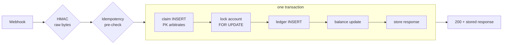

# ledger-guard

A Spring Boot / PostgreSQL service that applies signed payment webhooks to account balances **exactly once**, even when the same webhook is delivered concurrently, to different app instances, or retried after a failure.

[](https://github.com/atreyamitra/ledger-guard/actions/workflows/ci.yml)

A portfolio project with fictional data. It is a study of correctness under concurrency, **not** a production payment platform (see [Limitations](#limitations)).

## Why it is technically interesting

Payment providers retry webhooks, and retries race with the original. Getting "credit once" right needs more than an `if (!seen)` check. This project:

- **Persists idempotency in PostgreSQL** (a `PRIMARY KEY` claim row), so duplicates are arbitrated by the database across threads and across instances.
- **Authenticates the exact bytes** with HMAC-SHA256 *before* parsing, using a constant-time comparison.
- **Keeps claim + balance + ledger entry + stored response in one transaction**, so any failure un-claims the key.
- **Uses a pessimistic row lock** so different keys hitting one account cannot lose updates, and shows by mutation that the test suite notices when it is removed.
- **Pushes invariants into the schema**: CHECKs, FKs, a UNIQUE claim↔entry link, and an append-only trigger.
- **Reconciles** every balance against its ledger in a single MVCC snapshot.

## Architecture



Duplicate requests that lose the race get a unique violation, roll back, and replay the winner's stored response. Full diagrams, the duplicate-recovery walkthrough and the data model are in **[docs/ARCHITECTURE.md](docs/ARCHITECTURE.md)**.

## Core guarantees (each backed by a test)

| Guarantee | Test |
| --- | --- |
| 20 identical concurrent webhooks → one credit, 20 identical `200` bodies | `ConcurrencyTest.twentyParallelIdenticalWebhooksCreditExactlyOnce` |
| 30 duplicates split across **two application instances** sharing one DB → one credit | `MultiInstanceTest` |
| 50 requests = 10 keys × 5 duplicates → exactly 10 credits | `ConcurrencyTest.tenKeysWithFiveDuplicatesEachCreditExactlyTenTimes` |
| 20 different keys on one account → no lost credits (needs the row lock) | `ConcurrencyTest.differentKeysOnSameAccountDoNotLoseCredits` |
| Same key, different bodies, concurrently → one winner, rest `409` | `ConcurrencyTest.competingBodiesWithSameKeyHaveOneWinner` |
| Failure under concurrency (unknown account, overflow) leaves **no claim**, so retries still work | `ConcurrencyTest` failure-path tests, `ValidationTest` |
| The unique claim, not the app pre-check, is what stops a duplicate | `DatabaseConstraintsTest.uniqueClaimIsTheArbiter...` |
| Reconciliation never reports false drift while credits are in flight | `ConcurrencyTest.reconciliationNeverSeesDriftWhile...` |
| Bad / missing / truncated / non-hex / whitespace-tampered signatures → `401`, nothing written | `WebhookHmacTest`, `WebhookCryptoUnitTest` |
| Ledger rows cannot be updated, deleted or truncated; bad rows rejected by CHECK/FK | `ReconciliationTest`, `DatabaseConstraintsTest` |

## Tech stack

Java 17 · Spring Boot 3.3 (Web, Validation, Data JPA) · PostgreSQL 16 · Flyway · JUnit 5 · AssertJ · Testcontainers · Apache HttpClient 5 (tests) · Maven · GitHub Actions.

## Important engineering decisions

- **DB-backed idempotency, not an in-memory set or cache.** Memory is per-instance and lost on restart; the database is the one component every instance already shares.
- **Claim first, lock second.** The claim insert is flushed before the account lock, so a duplicate blocks on the index rather than on the account, and an unknown account rolls the claim back.
- **`WebhookService` is deliberately non-transactional**, so duplicate recovery (re-reading the winner) happens *after* the losing transaction has rolled back.
- **The body hash is over raw bytes.** `{"a":1}` and `{"a": 1}` are different bodies; reuse of a key with either is a `409`. Strictness beats guessing equivalence.
- **Strict JSON.** Unknown fields, duplicate keys, trailing tokens, fractional amounts and string-typed numbers are all rejected.
- **No default secret.** The app refuses to start without `WEBHOOK_SECRET` (≥ 16 chars).
- **Money is `long` minor units (paise), never floating point**; overflow is a domain exception that rolls everything back.

## Testing

45 tests: unit (crypto, domain), and integration tests that go over real HTTP into a real PostgreSQL, applying the real Flyway migrations. No mocks of the database or the service layer.

```sh
./mvnw -B verify      # needs Docker: Testcontainers starts postgres:16-alpine
```

Missing Docker is a **failure, not a skip**. Without Docker you may point the identical suite at a disposable PostgreSQL:

```sh
TEST_DB_URL=jdbc:postgresql://127.0.0.1:5432/ledger_test TEST_DB_USER=postgres ./mvnw -B test
```

Independent test signer (does not call production crypto); unique accounts/keys per test; parallel tests release all threads from a start barrier. See [VERIFICATION.md](VERIFICATION.md) for exactly what was run and what the concurrency tests do and do not prove.

## Quick start

```sh
docker run --rm -d --name lg-pg -e POSTGRES_DB=ledger_guard -e POSTGRES_USER=ledger_guard \
  -e POSTGRES_PASSWORD=ledger_guard -p 127.0.0.1:5432:5432 postgres:16-alpine
export WEBHOOK_SECRET='change-me-to-something-long'
./mvnw spring-boot:run          # listens on 127.0.0.1:8080; Flyway creates the schema
python3 scripts/demo.py         # in another shell: signs a payment, sends it twice, reconciles
```

Config: `DB_URL`, `DB_USERNAME`, `DB_PASSWORD`, `WEBHOOK_SECRET` (required), `SERVER_ADDRESS`.

## API

| Request | Success | Errors |
| --- | --- | --- |
| `POST /api/accounts` `{"ownerName":"Asha"}` | `201` `{id, ownerName, balance}` | `400` |
| `GET /api/accounts/{id}` | `200` | `400` bad id, `404` |
| `GET /api/accounts/{id}/entries` | `200` ordered entries | `404` |
| `POST /api/webhooks/payments` | `200` stored result | `401` bad signature · `400` invalid key/body/overflow · `404` unknown account · `409` key reused with a different body |
| `POST /api/admin/reconcile` | `200 {"ok":true}` | `409 {"ok":false,"drifts":[...]}` |

Webhook headers: `X-Signature` = hex HMAC-SHA256 of the exact body bytes; `Idempotency-Key` = 1–200 characters. Body: `{"accountId":"<uuid>","amountMinor":1000,"currency":"INR","eventId":"evt_123"}`. A replay returns the **original** response, including the balance at that time.

## Limitations

- Credit-only, INR-only, single-entry ledger: not double-entry accounting, settlement, or a production system.
- The **HMAC covers the body, not the `Idempotency-Key`, and there is no timestamp/replay window.** Someone who captures a valid signed body can resend it with a *new* key and be credited again. `eventId` is metadata, not a dedup key. A real design would sign a timestamp and key, or dedupe on a provider event id.
- Account, entries and reconcile endpoints have **no authentication**; the server binds to loopback by default. No TLS, rate limiting or request-size limit.
- Idempotency records never expire; entries and reconciliation are unpaginated full scans.
- Concurrency tests run in one JVM (plus a second in-process app context) against one PostgreSQL node, at `READ COMMITTED`. They do not cover multi-node databases, failover, or crashes mid-commit.

## Repository map

```text
src/main/java/.../api/           controllers, DTOs, error mapping
src/main/java/.../crypto/        HMAC + body hash
src/main/java/.../service/       WebhookService (replay/recovery), PaymentWriter (the transaction), ReconciliationService
src/main/java/.../domain/        Account, LedgerEntry (immutable), ProcessedWebhook
src/main/resources/db/migration/ V1 schema + append-only trigger, V2 claim↔entry link
src/test/java/.../               ConcurrencyTest, MultiInstanceTest, DatabaseConstraintsTest, ... (start here)
docs/ARCHITECTURE.md             diagrams, duplicate recovery, data model
INTERVIEW_NOTES.md               Q&A on the design
VERIFICATION.md                  what was run, results, what the tests do not prove
.github/workflows/ci.yml         Java 17 + Docker, ./mvnw verify
```

Read first: `PaymentWriter`, `WebhookService`, `V1`/`V2` migrations, `ConcurrencyTest`.
