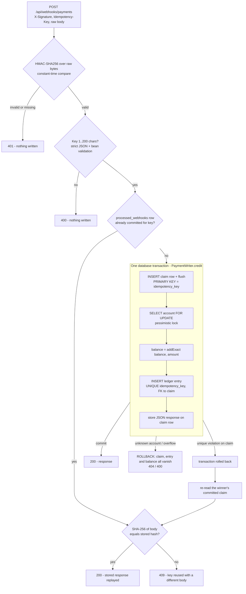

# Architecture

One Spring Boot service, one PostgreSQL database, three tables. No queues, no caches, no extra services: every guarantee below is enforced by the database and checked by a test.

## Request path



## Why the pieces are shaped this way

| Piece | Job | Where it is proven |
| --- | --- | --- |
| HMAC over the **raw** bytes, before parsing | Authenticates the sender and the exact payload; a re-serialized body would not verify | `WebhookHmacTest`, `WebhookCryptoUnitTest` |
| `processed_webhooks.idempotency_key` PRIMARY KEY | The arbiter between competing requests, across threads *and* instances. App-level checks are only an optimisation | `ConcurrencyTest`, `MultiInstanceTest`, `DatabaseConstraintsTest` |
| Claim inserted **first**, then flushed | The loser blocks inside PostgreSQL on the winner's uncommitted index entry, so it cannot proceed to touch the balance | `ConcurrencyTest` |
| `SELECT ... FOR UPDATE` on the account | Serialises *different* keys that hit the same account; without it, read-modify-write loses credits | `differentKeysOnSameAccountDoNotLoseCredits` (fails if the lock is removed) |
| One transaction for claim + balance + entry + response | All-or-nothing: a failure after the claim un-claims the key, so a retry can succeed | `ValidationTest.overflowRollsBackClaimEntryAndBalance`, concurrent failure tests |
| `ledger_entries.idempotency_key` UNIQUE + FK | The database itself refuses a second entry for one claim | `DatabaseConstraintsTest` |
| Append-only trigger on `ledger_entries` | UPDATE / DELETE / TRUNCATE rejected even from raw SQL | `ReconciliationTest`, `DatabaseConstraintsTest` |
| Reconciliation as a single SQL statement | One MVCC snapshot, so balance and entries are compared at the same instant; `SUM` is `numeric`, so it cannot wrap a `long` | `ReconciliationTest`, `reconciliationNeverSeesDriftWhileCreditsAreInFlight` |

## Duplicate recovery

`WebhookService.process` is intentionally **not** `@Transactional`.

1. Request B arrives while request A (same key) is mid-transaction. B's pre-check finds nothing committed.
2. B enters `PaymentWriter.credit` and its claim `INSERT` **blocks** on A's uncommitted row.
3. A commits. PostgreSQL now reports a unique violation to B. B's transaction rolls back (no balance or entry change).
4. Back in `WebhookService`, outside any failed transaction, B re-reads the committed claim and returns A's stored response, or 409 if the body hash differs.
5. If A had **rolled back** instead, B's insert succeeds and B runs the whole operation itself. This is why failures never poison a key.

The recovery only fires when a committed claim actually exists; an unrelated integrity error still surfaces as a 500 rather than being masked.

## Data model

```mermaid
erDiagram
    accounts ||--o{ ledger_entries : "account_id (FK)"
    processed_webhooks ||--o| ledger_entries : "idempotency_key (UNIQUE, FK)"
    accounts { uuid id PK; varchar owner_name; bigint balance "CHECK >= 0" }
    ledger_entries { uuid id PK; uuid account_id FK; bigint amount_minor "CHECK > 0"; varchar currency "CHECK = INR"; varchar event_id; timestamptz created_at; varchar idempotency_key "UNIQUE FK" }
    processed_webhooks { varchar idempotency_key PK; varchar body_hash "CHECK sha256 hex"; text response_body; timestamptz created_at }
```

`accounts.balance` is a denormalised running total; `ledger_entries` is the source of truth; reconciliation checks they agree.
